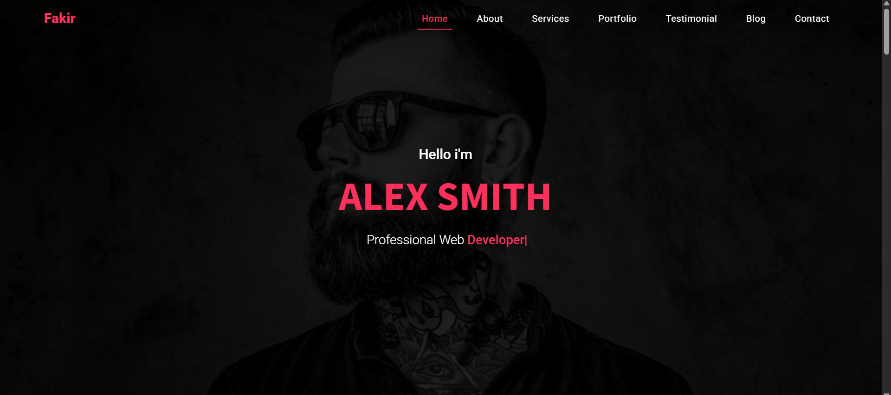

# 💼 Fakir - Personal Portfolio Website


<div align="center">

<p>
  <table>
    <tr>
      <td></td>
      <td></td>
      <td></td>
    </tr>
    <tr>
      <td></td>
      <td></td>
      <td></td>
    </tr>
    <tr>
      <td></td>
      <td></td>
      <td></td>
    </tr>
  </table>
  <br>
  <b>Fakir</b>: A modern, responsive personal portfolio website showcasing professional services, projects, and expertise with smooth animations and elegant design.
  <br>

[Live Demo](https://yourusername.github.io/Fakir-Site/) •
[Documentation](https://github.com/YourUsername/Fakir-Site/wiki) •
[Report Issues](https://github.com/YourUsername/Fakir-Site/issues)

</p>
</div>

**Fakir** is a professionally designed personal portfolio website built with modern web technologies (**HTML5**, **CSS3**, **JavaScript**). It features a clean, responsive design with smooth scrolling navigation, animated elements, and interactive sections to showcase professional services, projects, and personal brand effectively.



---

## 🧑‍💻 Tech Stack

<p>
  
  
  
  
  
</p>

---

## 🌐 Live Demo

Check out the live demo of **Fakir** at 👉 [Fakir Demo](https://yourusername.github.io/Fakir-Site/)

---

## 📑 Table of Contents

- [🚀 Features](#-features)
- [📂 Website Sections](#-website-sections)
- [🛠️ Technologies Used](#️-technologies-used)
- [📁 Project Structure](#-project-structure)
- [🔧 Installation](#-installation)
- [⚙️ Usage](#️-usage)
- [📱 Responsive Design](#-responsive-design)
- [🎨 Design Features](#-design-features)
- [📌 Future Improvements](#-future-improvements)
- [🤝 Contributing](#-contributing)
- [📜 License](#-license)

---

## 🚀 Features

- 🏠 **Hero Section**: Eye-catching welcome with animated typing text and professional introduction
- 👤 **About Section**: Personal information, skills, and downloadable CV with professional photo
- 🛠️ **Services Section**: Interactive service cards with hover effects showcasing expertise
- 🎨 **Portfolio Section**: Project showcase with filtering capabilities and image galleries
- 📊 **Statistics Section**: Animated counters displaying professional achievements
- 💬 **Client Feedback**: Testimonial slider with ratings and client reviews
- 📝 **Blog Section**: Latest articles and insights with publication dates
- 📧 **Contact Section**: Contact form and professional information
- 🧭 **Smooth Navigation**: Fixed navbar with smooth scrolling between sections
- 📱 **Fully Responsive**: Optimized for all devices (desktop, tablet, mobile)
- 🎯 **Interactive Elements**: Hover effects, animations, and smooth transitions

---

## 📂 Website Sections

### 🏠 Home Section
- **Hero Banner**: Full-screen background with overlay
- **Animated Introduction**: Typing animation for profession description
- **Call-to-Action**: Professional greeting and role presentation
- **Navigation Bar**: Fixed navbar with smooth scroll navigation

### 👤 About Section
- **Personal Information**: Name, age, location, email, availability status
- **Professional Photo**: High-quality portrait with elegant frame
- **Action Buttons**: Download CV and Hire Me buttons
- **Personal Description**: Brief professional summary

### 🛠️ Services Section
- **Service Cards**: Four main service offerings
  - UI/UX Design
  - Web Development
  - Mobile App Development
  - Digital Marketing
- **Interactive Cards**: Hover effects and smooth animations
- **Professional Icons**: Font Awesome icons for each service

### 🎨 Portfolio Section
- **Project Showcase**: Grid layout displaying completed projects
- **Category Filtering**: Sort projects by type (Web Design, Graphic Design, etc.)
- **Image Gallery**: High-quality project thumbnails
- **Project Details**: Brief descriptions and project highlights

### 📊 Statistics Section
- **Animated Counters**: Numbers that count up on scroll
- **Key Metrics**:
  - 150+ Happy Clients
  - 280+ Complete Projects
  - 1,500+ Files Downloaded
  - 50,000+ Lines of Code
- **Visual Impact**: Clean design with professional presentation

### 💬 Client Feedback Section
- **Testimonial Slider**: Multiple client reviews with smooth transitions
- **Star Ratings**: 5-star rating system for each review
- **Client Information**: Names, locations, and profile photos
- **Automatic Slideshow**: Auto-rotating testimonials

### 📝 Blog Section
- **Latest Articles**: Recent blog posts and insights
- **Publication Dates**: Timestamps for each article
- **Featured Images**: Thumbnail images for articles
- **Read More Links**: Direct links to full articles

---

## 🛠️ Technologies Used

### Core Technologies
- **HTML5**: Semantic structure and modern markup
- **CSS3**: Advanced styling, animations, and responsive design
- **JavaScript**: Interactive functionality and smooth animations

### Libraries & Frameworks
- **Font Awesome 6.4.0**: Professional icons and symbols
- **Google Fonts**: Roboto and Source Sans 3 typography
- **CSS Grid & Flexbox**: Modern layout techniques
- **CSS Animations**: Smooth transitions and hover effects

### Development Tools
- **VS Code**: Code editor with live server
- **Git**: Version control system
- **GitHub Pages**: Hosting and deployment

---

## 📁 Project Structure

```
📦task_4 Fokir 💼
 ┣ 📂.vscode
 ┃ ┗ 📜settings.json
 ┣ 📂CSS
 ┃ ┗ 📜style.css
 ┣ 📂Images
 ┃ ┣ 📂blog
 ┃ ┣ 📂portfolio
 ┃ ┣ 📜about.jpg
 ┃ ┣ 📜feedback.jpg
 ┃ ┣ 📜hero img.jpg
 ┃ ┣ 📜Lisa Martinez.jpg
 ┃ ┗ 📜Mohammed Ali.jpg
 ┣ 📂JS
 ┃ ┗ 📜main.js
 ┣ 📜Fakir.png
 ┣ 📜index.html
 ┣ 📜LICENSE.md
 ┗ 📜README.md

```

---

## 🔧 Installation

1. **Clone the repository**
```bash
git clone https://github.com/YourUsername/Fakir-Site.git
```

2. **Navigate to the project directory**
```bash
cd Fakir-Site
```

3. **Open the project**
   - Open `index.html` in your browser, or
   - Use a local server (recommended):
     - **VS Code**: Use Live Server extension
     - **Python**: `python -m http.server 8000`
     - **Node.js**: `npx serve` or `npx http-server`

4. **View the website**
   - Local server: `http://localhost:8000`
   - Direct file: Open `index.html` in browser

---

## ⚙️ Usage

### Navigation
- Use the fixed navigation bar to jump between sections
- Smooth scrolling automatically navigates to selected sections
- Active section highlighting in navigation menu

### Customization
1. **Personal Information**: Edit content in `index.html`
2. **Styling**: Modify colors and fonts in `CSS/style.css`
3. **Images**: Replace images in the `Images/` directory
4. **Services**: Update service cards with your offerings
5. **Portfolio**: Add your project images and descriptions

### Content Updates
- **About Section**: Update personal details and CV link
- **Services**: Modify service descriptions and icons
- **Portfolio**: Replace project images and add filtering categories
- **Statistics**: Update numbers to reflect your achievements
- **Testimonials**: Add real client feedback and reviews
- **Blog**: Update with your latest articles and insights

---

## 📱 Responsive Design

The website is fully responsive and optimized for:

- **Desktop** (1400px+): Full layout with all features
- **Laptop** (1024px - 1399px): Optimized spacing and sizing
- **Tablet** (768px - 1023px): Adapted layout for medium screens
- **Mobile** (320px - 767px): Mobile-first design with hamburger menu
- **Small Devices** (320px and below): Optimized for small screens

### Mobile Features
- Hamburger navigation menu
- Touch-friendly buttons and links
- Optimized image sizes
- Readable typography
- Streamlined layout

---

## 🎨 Design Features

### Visual Elements
- **Modern Color Scheme**: Professional red (#ff305b) accent with neutral grays
- **Typography**: Google Fonts (Roboto, Source Sans 3) for readability
- **Smooth Animations**: CSS transitions and hover effects
- **Professional Layout**: Clean, organized sections with proper spacing
- **Visual Hierarchy**: Clear distinction between headings, content, and actions

### Interactive Elements
- **Hover Effects**: Service cards, buttons, and navigation items
- **Smooth Scrolling**: Seamless navigation between sections
- **Animated Counters**: Statistics that count up when visible
- **Image Effects**: Portfolio hover states and transitions
- **Form Validation**: Contact form with input validation
- **Loading Animations**: Smooth page load transitions

### Accessibility Features
- **Semantic HTML**: Proper heading structure and landmarks
- **Alt Text**: Descriptive alt text for all images
- **Keyboard Navigation**: Full keyboard accessibility
- **Color Contrast**: WCAG compliant color combinations
- **Screen Reader Friendly**: Proper ARIA labels and structure

---

## 📌 Future Improvements

### Planned Features
- 🌙 **Dark Mode Toggle**: Switch between light and dark themes
- 🌐 **Multi-language Support**: Arabic and English language options
- 📧 **Contact Form Backend**: Functional contact form with email integration
- 🎨 **Advanced Animations**: AOS (Animate On Scroll) library integration
- 📊 **Analytics Integration**: Google Analytics for visitor tracking
- 🔍 **SEO Optimization**: Meta tags, structured data, and sitemap
- ⚡ **Performance Optimization**: Image optimization and lazy loading
- 🛡️ **Security Enhancements**: Content Security Policy headers

### Technical Improvements
- **Progressive Web App (PWA)**: Offline functionality and app-like experience
- **Content Management**: Headless CMS integration for easy content updates
- **Build Process**: Webpack or Vite for asset optimization
- **Testing**: Unit tests and cross-browser compatibility testing
- **CI/CD Pipeline**: Automated deployment and testing workflows

---

## 🤝 Contributing

We welcome contributions to improve Fakir! Here's how you can help:

### Getting Started
1. **Fork the repository**
2. **Create a feature branch**
```bash
git checkout -b feature/your-feature-name
```
3. **Make your changes**
4. **Test thoroughly**
5. **Commit your changes**
```bash
git commit -m "Add: Description of your feature"
```
6. **Push to your fork**
```bash
git push origin feature/your-feature-name
```
7. **Create a Pull Request**

### Contribution Guidelines
- Follow existing code style and structure
- Test your changes on multiple devices and browsers
- Update documentation if needed
- Add comments for complex functionality
- Ensure responsive design principles are maintained

### Areas for Contribution
- 🐛 Bug fixes and improvements
- 🎨 UI/UX enhancements
- 📱 Mobile optimization
- ⚡ Performance improvements
- 🌐 Accessibility improvements
- 📖 Documentation updates

---

## 📜 License

This project is licensed under the **MIT License** - see the [LICENSE](./LICENSE.md) file for details.

### MIT License Summary
- ✅ Commercial use allowed
- ✅ Modification allowed
- ✅ Distribution allowed
- ✅ Private use allowed
- ❌ No liability
- ❌ No warranty

---

<div align="center">

**⭐ If you found this project helpful, please give it a star! ⭐**

_Built with ❤️ by Omar Sakr_

[](https://github.com/OmarrSakr)

</div>

